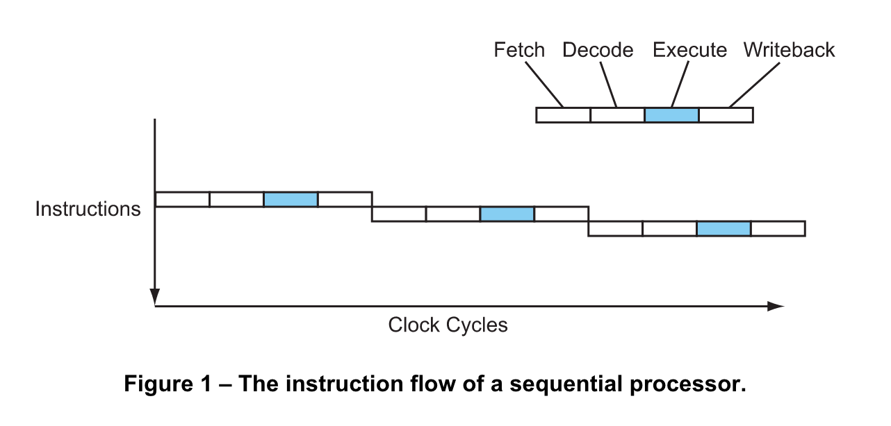

## Instruction Flow and Branch Predictions

Understanding how the hardware works is an critical component to understanding how to write the most performant code you can. Knowing the basics of processor instruction flow and branch predictions can help you make better decisions within the scope of writing idiomatic code.

## Acknowledgment
This content is provided by Lighterra, the software company of Jason Robert Carey Patterson. They work on a variety of software, including a cutting-edge code optimizer to make programs faster, a threading library for parallel programming, an iPhone user-interface library and a web video component.

[Modern Microprocessors](http://www.lighterra.com/papers/modernmicroprocessors/)

## Notes

* Each instruction takes 4 cycles over 4 stages (Fetch, Decode, Execute, Writeback)
* Pipelines allows these stages to happen concurrently by overlapping each stage.
* Branching requires prediction to keep the pipleline running efficiently.
* Barch mispredictions cause a lot of performance problems.

### Basic Instruction Flow
Instructions are executed one after the other inside the processor, right? Well, that makes it easy to understand, but that's not really what happens. In fact, that hasn't happened since the middle of the 1980s. Instead, several instructions are all partially executing at the same time.

Consider how an instruction is executed – first it is fetched, then decoded, then executed by the appropriate functional unit, and finally the result is written into place. With this scheme, a simple processor might take 4 cycles per instruction (CPI = 4)...

Modern processors overlap these stages in a pipeline, like an assembly line. While one instruction is executing, the next instruction is being decoded, and the one after that is being fetched...

Now the processor is completing 1 instruction every cycle (CPI = 1). This is a four-fold speedup without changing the clock speed at all. Not bad, huh?

### Basic Branch Prediction
A key problem of pipelining is branches. Consider the following code sequence...

	01 if (a > 7) {
	02    b = c;
	03 } else {
	04    b = d;
	05 }

Now consider a pipelined processor executing this code sequence. By the time the conditional branch at line 01 reaches the execute stage in the pipeline, the processor must have already fetched and decoded the next couple of instructions. But which instructions? Should it fetch and decode the if branch (line 02) or the else branch (line 04)? It won't really know until the conditional branch gets to the execute stage, but in a deeply pipelined processor that might be several cycles away. And it can't afford to just wait – the processor encounters a branch every six instructions on average, and if it was to wait several cycles at every branch then most of the performance gained by using pipelining in the first place would be lost.

So the processor must make a guess. The processor will then fetch down the path it guessed and speculatively begin executing those instructions. Of course, it won't be able to actually commit (writeback) those instructions until the outcome of the branch is known. Worse, if the guess is wrong the instructions will have to be cancelled, and those cycles will have been wasted. But if the guess is correct the processor will be able to continue on at full speed.

Nonetheless, even the very best modern processors with the best, smartest branch predictors only reach a prediction accuracy of about 95%, and still lose quite a lot of performance due to branch mispredictions.

## Links

http://www.lighterra.com/papers/modernmicroprocessors/

## Code Review

[Prediction](prediction.go) ([Go Playground](http://play.golang.org/p/VxnL7AEZSl))

[Tests](prediction_test.go) ([Go Playground](http://play.golang.org/p/M7KmittyJH))

