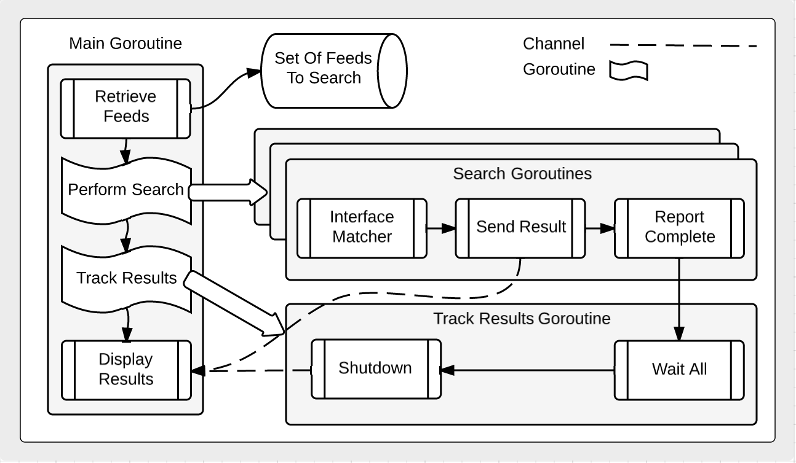

## Sample Program

To see Go in action we are going to review a complete Go program. The program implements functionality that can be found in many Go programs being developed today. The program pulls different data feeds from the web and compares the content against a search term. The content that matches is then displayed to the terminal window. The program reads text files, makes web calls, decodes both XML and JSON into struct type values and finally does all of this using Go concurrency to make things fast.

## Program Architecture

The program is broken into several distinct steps that run across many different goroutines. We will explore the code as it flows from the main goroutine into the searching and tracking goroutines and then back to the main goroutine. To start, let's review the structure of the project:

*cd $GOPATH/src/github.com/ArdanStudios/go_in_action/sample*

* **sample**
	* **data**
		* [data.json](../sample/data/data.json) -- Contains a list of data feeds
	* **matchers**
		* [rss.go](../sample/matchers/rss.go) -- Matcher for searching rss feeds
	* **search**
		* [default.go](../sample/search/default.go) -- Default matcher for searching data
		* [feed.go](../sample/search/feed.go) -- Support for reading the json data file
		* [match.go](../sample/search/match.go)-- Interface support for using different matchers
		* [search.go](../sample/search/search.go)-- Main program logic for performing search
	* [main.go](../sample/main.go) -- Programs entry point

The code is organized into these four folders which are listed in alphabetical order. The folder contains a JSON document of data feeds data the program will retrieve and process to match the search term. The matchers folder contains the code for the different types of feeds the program supports. Currently the program only supports one matcher that processes RSS type feeds. The search folder contains the business logic for using the different matchers to search content. Finally we have the parent folder called sample that contains the main.go code file which is the entry point for the program.

Now that we have seen where all the code for the program is, we can begin to explore and understand how the program works.