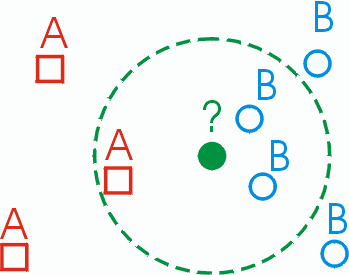

## Classification - k Nearest Neighbors

Classification is distinct from Regression in that the target variable is typically categorical or labeled.  For example, a classification model may classify emails into spam and not-spam categories or classify network traffic as fraudulent or not fraudulent.  Generally, these models may classify into any number of categories.  Here we will explore classification using the k Nearest Neighbor algorithm.

## k Nearest Neighbors

from [Machine Learning Mastery](http://machinelearningmastery.com/tutorial-to-implement-k-nearest-neighbors-in-python-from-scratch/)

## Notes

- Classification is typically a "supervised" machine learning task.  That is, typically you need to have a labeled data set (e.g., spam, not spam).
- Closeness or similarity implies a metric.  We will use Euclidean distance here for kNN, but, in general, the choice of metric will depend on what types of features you have (categorical, numeric, etc.). For more on distance metrics see [here](https://youtu.be/_EEcjn0Uirw).
- kNN is easy to understand and thus a good place to start for classification problems.
- kNN calculates distances on each prediction, so everything happens on the fly.  There isn't really a "trained" model. 

## Links

[How the kNN algorithm works](https://youtu.be/UqYde-LULfs)   
[k Nearest Neighbors - Classification](http://www.saedsayad.com/k_nearest_neighbors.htm)

## Code Review

[Profile the data](example1/example1.go)  
[Train and use cross-validation to  validate a kNN model](example2/example2.go)    

## Exercises

### Exercise 1

Find an optimal `k` value for the above model of iris species. That is, search over various k values and evaluate the predictions.

[Template](exercises/template1/template1.go) |
[Answer](exercises/exercise1/exercise1.go)

___
All material is licensed under the [Apache License Version 2.0, January 2004](http://www.apache.org/licenses/LICENSE-2.0).
