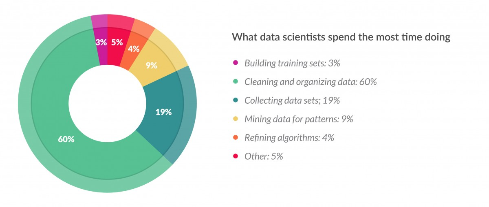

## Maintaining Integrity in Data Science Applications

Data science is the process of turning raw data into insights.  The process is meant to drive decision making within an organization.  Those practicing data science take advantage of software engineering, statistical, and scientific skills to develop insights from raw data.

## Notes

* The data science process almost always involves:
    * Data gathering, organization, and cleaning.
    * Data parsing and/or pattern extraction.
    * Arithmetic
    * Conveying results.
* Sometimes arithmetic includes sophisticated neural networks, but it may just include aggregations (sums, calculating a maximum value, etc.) or fitting a line.
* Conveying results may include passing messages to another backend service or it may include non-technical/visual explanation of predictions. 

## How a data scientist spends their time

from [Forbes](http://www.forbes.com/sites/gilpress/2016/03/23/data-preparation-most-time-consuming-least-enjoyable-data-science-task-survey-says)

## Links

[Go for Data Science](https://youtu.be/D5tDubyXLrQ)  
[Doing data science at Twitter](https://medium.com/@rchang/my-two-year-journey-as-a-data-scientist-at-twitter-f0c13298aee6#.hdprnhlv5)  

## Exercises

___
All material is licensed under the [Apache License Version 2.0, January 2004](http://www.apache.org/licenses/LICENSE-2.0).
