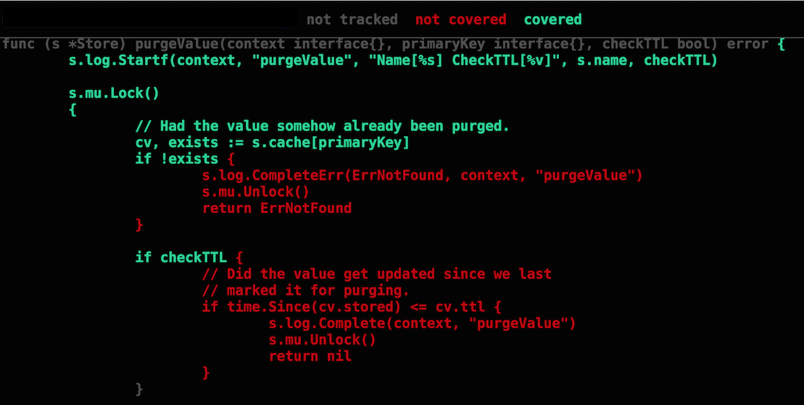

## Testing

Testing is built right into the go tools and the standard library. Testing needs to be a vital part of the development process because it can save you a tremendous amount of time throughout the life cycle of the project. Benchmarking is also a very powerful tool tied to the testing functionality. Aspect of your code can be setup to be benchmarked for performance reviews. Profiling provides a view of the interations between functions and which functions are most heavlily used.

## Notes

* The Go toolset has support for testing and benchmarking.
* The tools are very flexible and give you many options.
* Write tests in tandem with development.
* Example code serve as both a test and documentation.
* Benchmark throughout the dev, qa and release cycles.
* If performance problems are observed, profile your code to see what functions to focus on.
* The tools can interfere with each other. For example, precise memory profiling skews CPU profiles, goroutine blocking profiling affects scheduler trace, etc. Rerun tests for each needed profiling mode.

## Links

http://golang.org/pkg/testing/  
http://dave.cheney.net/2013/06/30/how-to-write-benchmarks-in-go  
http://saml.rilspace.org/profiling-and-creating-call-graphs-for-go-programs-with-go-tool-pprof  
http://golang.org/pkg/net/http/pprof/  
https://software.intel.com/en-us/blogs/2014/05/10/debugging-performance-issues-in-go-programs  
https://github.com/dvyukov/go-fuzz  
https://talks.golang.org/2015/dynamic-tools.slide#1  
https://vimeo.com/141698770  
[Structuring Tests in Go](https://medium.com/@benbjohnson/structuring-tests-in-go-46ddee7a25c#.b2m3nziyb) - Ben Johnson  
[Advanced Testing Concepts for Go 1.7](https://speakerdeck.com/mpvl/advanced-testing-concepts-for-go-1-dot-7) - Marcel van Lohuizen  

## Code Review

[Basic Unit Test](example1/example1_test.go) ([Go Playground](http://play.golang.org/p/bYkkr3uQcp))  
[Table Unit Test](example2/example2_test.go) ([Go Playground](http://play.golang.org/p/hhavdseEPj))  
[Mocking Web Server Response](example3/example3_test.go) ([Go Playground](https://play.golang.org/p/JJ_2VIL_R6))  
[Testing Internal Endpoints](example4/handlers/handlers_test.go) ([Go Playground](https://play.golang.org/p/bGM-oA6KT-))  
[Example Test](example4/handlers/handlers_example_test.go) ([Go Playground](http://play.golang.org/p/BTSUkNQn3r))  
[Sub Tests](example5/example5_test.go) ([Go Playground](http://play.golang.org/p/_ksJdlKox7))  

## Coverage

Making sure your tests cover as much of your code as possible is critical. Go's testing tool allows you to create a profile for the code that is executed during all the tests and see a visual of what is and is not covered.

	go test -coverprofile cover.out
	go tool cover -html=cover.out

___
All material is licensed under the [Apache License Version 2.0, January 2004](http://www.apache.org/licenses/LICENSE-2.0).
